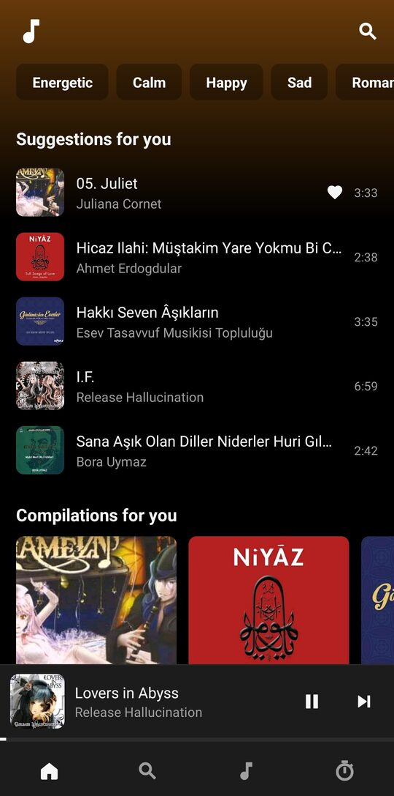

# Nota

An Android music player for the audio already on the phone, with a Discover tab for everything
else. No Gradle, no AndroidX, no third-party libraries: the app is plain Java against the
framework, built by a shell script that drives `aapt2`, `javac`, `d8` and `apksigner` by hand.

| Home | Now playing |
| --- | --- |
|  |  |

## What it does

- **Library** — tracks, albums, artists and folders from MediaStore, with a background service,
  lock-screen controls and an equalizer.
- **Lyrics** — a `.lrc` or `.txt` file next to the audio file, otherwise [LRCLIB](https://lrclib.net).
  Timed lines follow playback; the current one also appears above the title in the player.
- **Artist info** — the latin reading of a non-latin stage name, the legal name behind an alias
  and the one-line description [MusicBrainz](https://musicbrainz.org) keeps.
- **Discover** — searching and playing from YouTube and the Internet Archive.
- **Data saver** — every network answer is cached on disk with its own freshness window, and the
  app reports what it spent.

Interface strings are English and Turkish; code and comments are English.

## Building

You need a JDK 21, the Android command line tools that Termux packages, and one Google-licensed
binary the repository cannot carry:

```sh
pkg install openjdk-21 aapt2 d8 apksigner zip     # Termux
cp .../platforms/android-33/android.jar tools/android33.jar
./build.sh
```

The script generates a debug keystore on the first run and leaves the signed APK in
`build/nota.apk`. The platform jar can also be pointed at from outside:

```sh
ANDROID_JAR=/path/to/android.jar ./build.sh
```

## The stream helper

YouTube stops feeding a request built by a phone after about a minute, so a small Python service
(`notastream`) does the extraction on a server and answers ranged GETs. That deployment is not
part of this repository: its address, the secret it shares with the app and its self-signed
certificate would turn any clone into a free proxy for it.

`build.sh` therefore writes example copies of three files when they are missing, and the build
succeeds with them — only the Discover tab stays silent:

| file | comes from | holds |
| --- | --- | --- |
| `src/com/nota/data/Backend.java` | `tools/Backend.java.template` | helper address, shared secret |
| `res/xml/network_security_config.xml` | `tools/network_security_config.xml.template` | the address the certificate is pinned to |
| `res/raw/notastream.pem` | generated throwaway certificate | the helper's certificate |

To run your own helper, point all three at it. Requests are signed with HMAC-SHA256 over
`v=<id>&e=<expiry>` and expire after twelve hours, and the helper caps requests and extractions
per address per hour. The secret ships inside the APK, so it is not a credential: it means that
knowing the address is not enough, and that both ends can be given a new one.

Everything the app speaks to is over TLS. The helper has no domain and no public authority will
issue for a bare IP, so its certificate is self-signed and pinned as the only trust anchor for
that address — stricter than the public roots, but it means a new certificate needs a new build.

## Licence

MIT, see [LICENSE](LICENSE). Nota is not affiliated with YouTube, MusicBrainz, LRCLIB or the
Internet Archive; it only asks their public endpoints.
